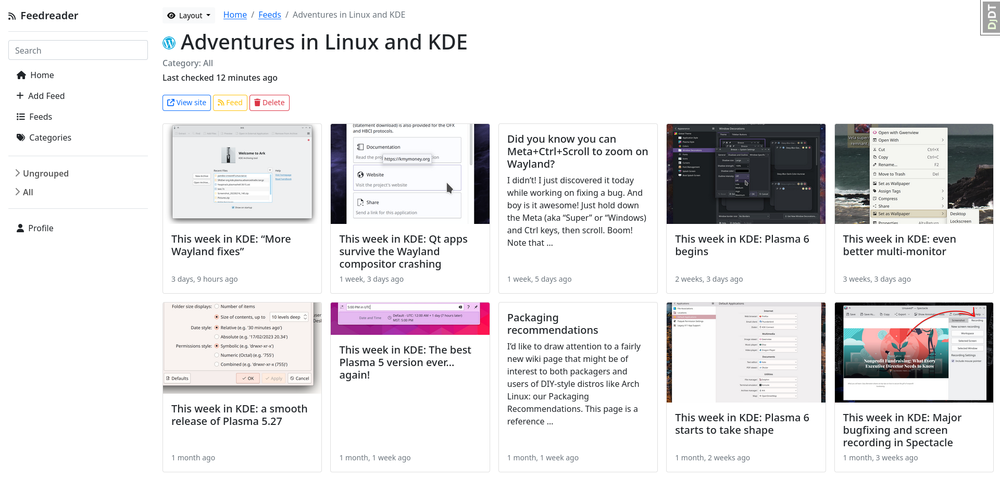

# Setup

Install the dependencies

    pipenv install --dev

The application expects a file called `secrets.env` in the project root with the following variables:

    GOOGLE_CLIENT_ID=XYZ
    GOOGLE_CLIENT_SECRET=XYZ

Mmake/run the migrations:

    ./manage.py makemigrations

    ./manage.py migrate

Create a superuser/root/administrator account:

    ./manage.py createsuperuser

# Running

Start celery worker / beat

    celery -A feedreader worker --beat --scheduler django --loglevel=info

Start a redis instance in the background:

    docker run --name redis -p 6379:6379 -d redis

Start the app

    ./manage.py runserver

Then visit localhost:8000
